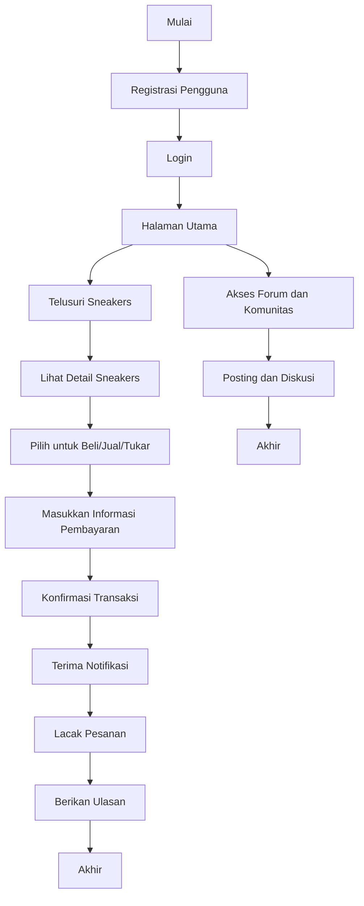

## Pemahaman Bisnis untuk Kshoe's

### Pemahaman Bisnis
Kshoe's adalah platform online inovatif yang dirancang untuk memenuhi kebutuhan para penggemar dan kolektor sepatu sneakers. Misi kami adalah menyediakan pengalaman yang mulus dan ramah pengguna bagi pengguna untuk membeli, menjual, dan menukar sneakers. Kami bertujuan membangun komunitas di mana para pecinta sneakers dapat terhubung, berbagi minat mereka, dan mengakses berbagai koleksi sneakers, dari rilis terbaru hingga koleksi langka.

### Poin Kunci
1. **Pemahaman Bisnis**:
    - **Misi**: Menciptakan pasar online terbaik dan komunitas bagi para pecinta sneakers.
    - **Tujuan**:
        - Menyediakan platform bagi pengguna untuk membeli, menjual, dan menukar sneakers.
        - Menawarkan berbagai koleksi sneakers, dari rilis terbaru hingga koleksi langka.
        - Membangun komunitas pecinta sneakers.
    
2. **Target Utama**:
    - Penggemar dan kolektor sneakers.
    - Dewasa muda berusia 18-35 tahun.
    - Penduduk perkotaan dan individu yang sadar mode.
    - Individu yang mencari penawaran sneakers yang langka dan eksklusif.

3. **Fitur Utama**:
    - Registrasi Pengguna dan Manajemen Profil.
    - Daftar Sneakers: Memungkinkan pengguna untuk mendaftarkan sneakers untuk dijual atau ditukar.
    - Pencarian dan Filter: Memungkinkan pengguna mencari sneakers berdasarkan merek, ukuran, harga, dan kondisi.
    - Manajemen Transaksi: Gateway pembayaran yang aman dan pelacakan pesanan.
    - Fitur Komunitas: Forum, ulasan, dan integrasi media sosial.

4. **Kebutuhan Bisnis**:
    - Platform web yang aman dan dapat diskalakan.
    - Antarmuka yang intuitif dan ramah pengguna.
    - Backend yang kuat untuk menangani transaksi dan data pengguna.
    - Sistem pencarian dan rekomendasi yang efektif.
    - Strategi pemasaran dan keterlibatan komunitas yang kuat.

### Diagram Alur Proses
Berikut adalah diagram alur proses untuk Kshoe's:



### Implementasi Program dalam Bahasa C++

Berikut adalah contoh implementasi sederhana dalam bahasa C++ untuk beberapa fitur utama dari Kshoe's:

```cpp
#include <iostream>
#include <vector>
#include <string>

using namespace std;

// Struktur untuk menyimpan data pengguna
struct User {
    string username;
    string password;
    string email;
};

// Struktur untuk menyimpan data sneakers
struct Sneaker {
    string brand;
    string model;
    double price;
    string condition;
};

// Fungsi untuk registrasi pengguna
void registerUser(vector<User>& users) {
    User newUser;
    cout << "Masukkan username: ";
    cin >> newUser.username;
    cout << "Masukkan password: ";
    cin >> newUser.password;
    cout << "Masukkan email: ";
    cin >> newUser.email;
    users.push_back(newUser);
    cout << "Registrasi berhasil!\n";
}

// Fungsi untuk login pengguna
bool loginUser(vector<User>& users) {
    string username, password;
    cout << "Masukkan username: ";
    cin >> username;
    cout << "Masukkan password: ";
    cin >> password;
    for (const auto& user : users) {
        if (user.username == username && user.password == password) {
            cout << "Login berhasil!\n";
            return true;
        }
    }
    cout << "Login gagal! Username atau password salah.\n";
    return false;
}

// Fungsi untuk menambah sneakers
void addSneaker(vector<Sneaker>& sneakers) {
    Sneaker newSneaker;
    cout << "Masukkan merek: ";
    cin >> newSneaker.brand;
    cout << "Masukkan model: ";
    cin >> newSneaker.model;
    cout << "Masukkan harga: ";
    cin >> newSneaker.price;
    cout << "Masukkan kondisi: ";
    cin >> newSneaker.condition;
    sneakers.push_back(newSneaker);
    cout << "Sneakers berhasil ditambahkan!\n";
}

// Fungsi untuk menampilkan daftar sneakers
void displaySneakers(const vector<Sneaker>& sneakers) {
    cout << "Daftar Sneakers:\n";
    for (const auto& sneaker : sneakers) {
        cout << "Merek: " << sneaker.brand << ", Model: " << sneaker.model
             << ", Harga: " << sneaker.price << ", Kondisi: " << sneaker.condition << endl;
    }
}

int main() {
    vector<User> users;
    vector<Sneaker> sneakers;
    int choice;
    
    do {
        cout << "1. Registrasi\n2. Login\n3. Tambah Sneakers\n4. Tampilkan Sneakers\n5. Keluar\n";
        cout << "Masukkan pilihan: ";
        cin >> choice;

        switch (choice) {
            case 1:
                registerUser(users);
                break;
            case 2:
                loginUser(users);
                break;
            case 3:
                addSneaker(sneakers);
                break;
            case 4:
                displaySneakers(sneakers);
                break;
            case 5:
                cout << "Terima kasih telah menggunakan Kshoe's!\n";
                break;
            default:
                cout << "Pilihan tidak valid!\n";
        }
    } while (choice != 5);

    return 0;
}
```

Kode di atas adalah implementasi dasar dari beberapa fitur utama, seperti registrasi pengguna, login pengguna, penambahan sneakers, dan tampilan daftar sneakers. Implementasi lebih lanjut akan mencakup lebih banyak fitur dan penanganan kasus khusus sesuai dengan kebutuhan bisnis yang telah diidentifikasi.