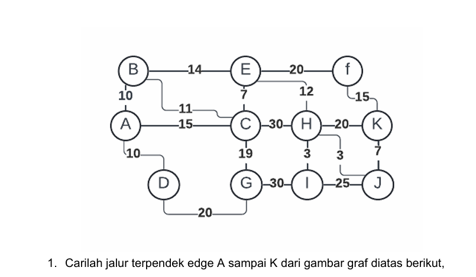
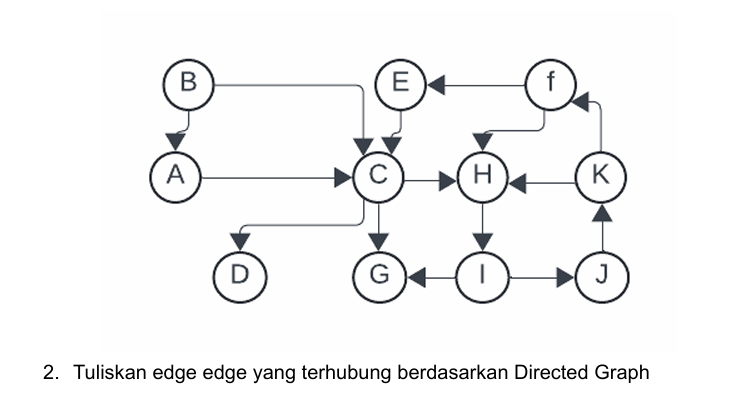

# Jawaban

Jarak terdekat untuk titik A menuju titik K yaitu:

> A ⇒ C ⇒ E ⇒ H ⇒ J ⇒ k  

   

# Jawaban
 
Edge-Edge yang terhubung berdasarkan directed graf di atas:
  

* > Vertex = A, B, C, D, E, F, G, H, I, J, K
* > `Edge = `

        1. <A,C>
        2. <B,A>, <B,C>
        3. <C,H>, <C,G>, <C,D>
        4. <E,C>
        5. <F,E>, <F,H>
        6. <H,I>
        7. <I,G>, <I,J>
        8. <J,K>
        9. <K,H>, <K,F>

